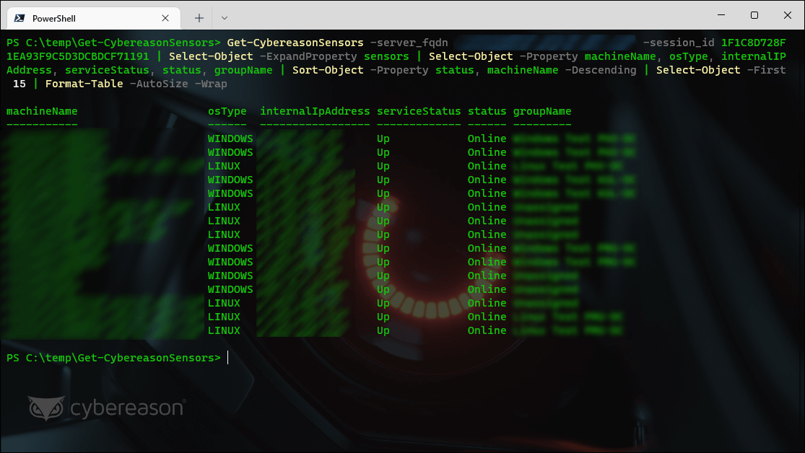

# [Get-CybereasonSensors 1.0.0](https://github.com/Cybereason-Fan/Get-CybereasonSensors)

### Retrieves the list of sensors from an on-premises Cybereason API
> Requires an account on an on-premises Cybereason management console



❗ You must load this script as a "dot sourced" script (see the screenshot above!)
```
. .\Get-CybereasonSensors.ps1
```
```
SYNTAX
    Get-CybereasonSensors [-session_id] <String> [-server_fqdn] <String> [[-limit] <String>] [[-offset] <String>]
    [-DebugMode] [<CommonParameters>]


DESCRIPTION
    Retrieves the list of sensors from an on-premises Cybereason API as an array of PSCustomObjects which you will need to parse further.
``` 

❓ Not sure where to get the session id? Try [Get-CybereasonCookie](https://github.dhl.com/Cybereason-Fan/Get-CybereasonCookie)

## 1.0.0

Initial Release
